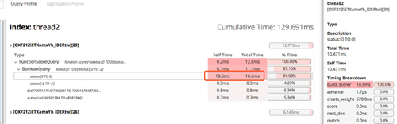
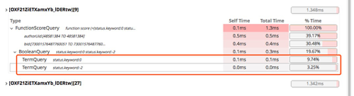

# 事由

应用部门反应搜索中间件，响应速度偶然过慢，查询搜索日志发现不定时会有超过2s的响应。

#排查

分析DSL，看下DSL是否使用不当，一番检查后没有发现DSL异常。使用Search Profiler分析DSL，结果如下图：

status=0 这个条件竟然使用了10.5ms 并且status类型是int 使用term查询，结果超乎想象。

# 分析问题

为什么number类型的竟然需要查询那么久，生产环境使用的ES是5.6.5,lucene是6.6.1，一番搜索后发现**lucene6.0以上版本引入了重新设计的数值类型的索引结构，不再采用倒排索，而是使用了更适合范围查找的Block K-d Tree， ES从5.0开始引入这种新结构。
Term Query由于通常非常快，从5.1.1开始不再被缓存到Query Cache**

# 确定解决方案

因status只是用来标记状态的字段，并不会用作范围查找，而且status的值也就只有那么几种，比较适合使用keyword来存储。

# 优化

把status改为keyword结构后，搜索效率有一个质的飞跃

建议，不做范围查找的字段都设置为keyword类型。

# 参考

[number?keyword?傻傻分不清楚
](https://elasticsearch.cn/article/446)

